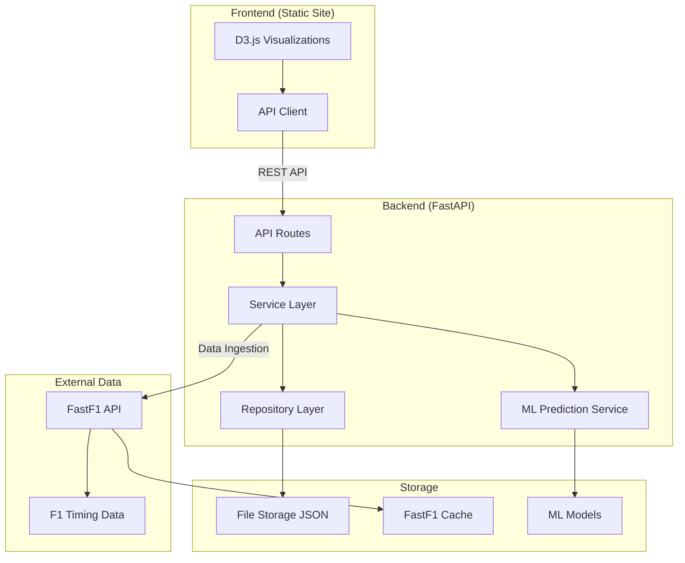
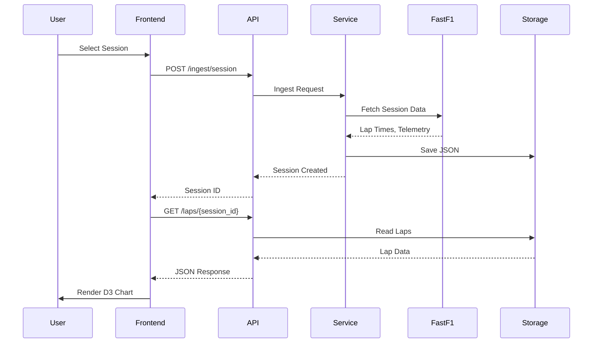

# F1-Dash

A Python-backed D3.js web application for F1 enthusiasts to visualize lap times, tire strategies, driver/team performance, telemetry, and race analytics with ML-powered race predictions.

**Live Demo:** [https://f1-dash.live/](https://f1-dash.live/)

## Features

- **Lap Time Analysis** - Scatter plots, box plots, lap-by-lap progression with outlier filtering
- **Tire Strategy Visualization** - Stint bars with compound colors, pit stop timing
- **Telemetry Overlays** - Speed traces, throttle/brake, gear shifts, multi-channel comparison
- **Driver Comparisons** - Head-to-head lap times, sector comparisons
- **Race Progression** - Position changes over laps, gap analysis
- **Stint Analysis** - Tire degradation curves, compound performance
- **Race Predictions (ML)** - XGBoost-powered race predictions based on practice session data

## Architecture



### Component Flow



## Tech Stack

### Backend
- **FastAPI** - Modern Python web framework with async support
- **FastF1** - F1 data access library (2018+ seasons)
- **Pydantic** - Data validation and serialization
- **XGBoost** - Machine learning for race predictions
- **Repository Pattern** - Pluggable storage (file-based JSON, ready for DynamoDB)

### Frontend
- **D3.js** - Data visualization library
- **Vanilla JavaScript** - No framework dependencies
- **ES Modules** - Modern JavaScript architecture

### Security
- Security headers middleware (CSP, X-Frame-Options, etc.)
- Rate limiting (100 req/min API, 5 req/min ingestion)
- CORS configuration with explicit origins
- API key authentication for sensitive endpoints
- XSS prevention (safe DOM manipulation)
- Path traversal protection

## Quick Start

### Prerequisites
- Python 3.11+
- Node.js (optional, for frontend development server)

### Backend Setup

```bash
cd backend

# Create virtual environment
python -m venv venv
source venv/bin/activate  # On Windows: venv\Scripts\activate

# Install dependencies
pip install -r requirements.txt

# Configure environment (optional)
cp .env.example .env

# Run the server
uvicorn app.main:app --reload
```

The API will be available at `http://localhost:8000`
- API Documentation: `http://localhost:8000/docs`
- OpenAPI Schema: `http://localhost:8000/openapi.json`
- Health Check: `http://localhost:8000/health`

### Frontend Setup

```bash
cd frontend

# Option 1: Python simple server
python -m http.server 3000

# Option 2: Any static file server
npx serve -l 3000
```

The frontend will be available at `http://localhost:3000`

## Deployment

### Render (Recommended)

This project includes a `render.yaml` blueprint for easy deployment:

1. Push your code to GitHub
2. Go to [render.com](https://render.com) and create a new Blueprint
3. Connect your GitHub repository
4. Render will auto-detect the `render.yaml` and create both services

After deployment, configure environment variables in the Render dashboard:
- `F1_CORS_ORIGINS` - Your frontend URL (e.g., `https://f1-dash.live`)
- `F1_API_KEYS` - Optional API keys for protected endpoints

Update `frontend/config.js` with your backend URL:
```javascript
window.F1_API_URL = 'https://f1-dash-api.onrender.com/api/v1';
```

### Environment Variables

| Variable | Description | Default |
|----------|-------------|---------|
| `F1_ENVIRONMENT` | `development`, `staging`, or `production` | `development` |
| `F1_CORS_ORIGINS` | Comma-separated allowed origins | `http://localhost:3000` |
| `F1_API_KEYS` | Comma-separated API keys | (none) |
| `F1_API_KEY_AUTH_ENABLED` | Enable API key auth | `false` |
| `F1_RATE_LIMIT_ENABLED` | Enable rate limiting | `true` |
| `F1_TRUSTED_HOSTS` | Allowed hosts (production) | `localhost` |

## API Endpoints

### Schedule (FastF1 Available Data)
- `GET /api/v1/schedule/years` - Get available years
- `GET /api/v1/schedule/events/{year}` - Get events for a year
- `GET /api/v1/schedule/sessions/{year}/{round}` - Get sessions for an event

### Sessions (Ingested Data)
- `GET /api/v1/sessions` - List sessions (filterable by year)
- `GET /api/v1/sessions/years` - Get available years
- `GET /api/v1/sessions/events/{year}` - Get events for a year
- `GET /api/v1/sessions/id/{session_id}` - Get specific session
- `GET /api/v1/sessions/{year}/{round}` - Get event sessions

### Laps
- `GET /api/v1/laps/{session_id}` - Get session laps
- `GET /api/v1/laps/{session_id}/fastest` - Get fastest laps
- `GET /api/v1/laps/{session_id}/distribution` - Lap time distribution
- `GET /api/v1/laps/{session_id}/compound-performance` - Compound analysis

### Strategy
- `GET /api/v1/strategy/{session_id}/stints` - Get tire stints
- `GET /api/v1/strategy/{session_id}/summary` - Strategy summary

### Telemetry
- `GET /api/v1/telemetry/{session_id}/{driver}/{lap}` - Get lap telemetry
- `POST /api/v1/telemetry/{session_id}/compare` - Compare multiple laps

### Predictions (ML)
- `GET /api/v1/predictions/race/{year}/{round}` - Get race prediction
- `GET /api/v1/predictions/backtest/{year}/{round}` - Backtest with actual results
- `GET /api/v1/predictions/model/info` - Model status and info
- `POST /api/v1/predictions/train` - Train the prediction model

### Data Ingestion
- `GET /api/v1/ingest/status/{year}/{round}/{session}` - Check ingestion status
- `POST /api/v1/ingest/session` - Ingest session data
- `POST /api/v1/ingest/telemetry` - Ingest telemetry data

## Development

### Running Tests

```bash
cd backend
source venv/bin/activate

# Run all tests
pytest

# Run with coverage
pytest --cov=app

# Run specific test file
pytest tests/unit/test_services.py -v
```

### Project Structure

```
f1-dash/
├── README.md
├── render.yaml              # Render deployment blueprint
├── backend/
│   ├── app/
│   │   ├── api/             # FastAPI routes
│   │   │   ├── schemas/     # Request/Response schemas
│   │   │   └── v1/          # API version 1 endpoints
│   │   ├── config.py        # Settings management
│   │   ├── dependencies.py  # Dependency injection
│   │   ├── domain/          # Domain models and enums
│   │   │   ├── enums/
│   │   │   └── models/
│   │   ├── ingestion/       # FastF1 data fetching
│   │   ├── main.py          # Application entry point
│   │   ├── middleware/      # Security middleware
│   │   ├── repositories/
│   │   │   ├── file/        # File-based implementations
│   │   │   └── interfaces/  # Abstract repository interfaces
│   │   └── services/        # Business logic layer
│   ├── data/
│   │   └── models/          # Pre-trained ML models
│   ├── tests/
│   └── requirements.txt
└── frontend/
    ├── index.html
    ├── config.js            # API URL configuration
    ├── css/
    └── js/
        ├── api/             # API client
        ├── charts/          # D3.js chart components
        └── utils/           # Utilities (colors, formatters, security)
```

## ML Predictions

The prediction model uses XGBoost trained on historical race data (2023-2024 seasons):

**Features (15 total):**
- Best lap delta, average pace delta, consistency (std dev) for FP1, FP2, FP3
- Session positions for each practice session
- Long run pace delta for each session

**Model Performance:**
- MAE: ~0.49 positions (training data)
- 87% of predictions within 1 position

Pre-trained model files are included in `backend/data/models/` for production deployment.

## Data Sources

Data is fetched from the official F1 timing system via the [FastF1](https://github.com/theOehrly/Fast-F1) library. Available data includes:
- Sessions from 2018 onwards
- Lap timing and sector times
- Tire compound and stint information
- Car telemetry (speed, throttle, brake, gear)
- Weather conditions
- Race control messages

## Security Considerations

For production deployment:
- Set `F1_ENVIRONMENT=production`
- Configure `F1_CORS_ORIGINS` to your specific frontend domain
- Enable API key authentication for ingestion endpoints
- Use HTTPS (handled automatically by Render)
- Review and configure `F1_TRUSTED_HOSTS`

## License

MIT
